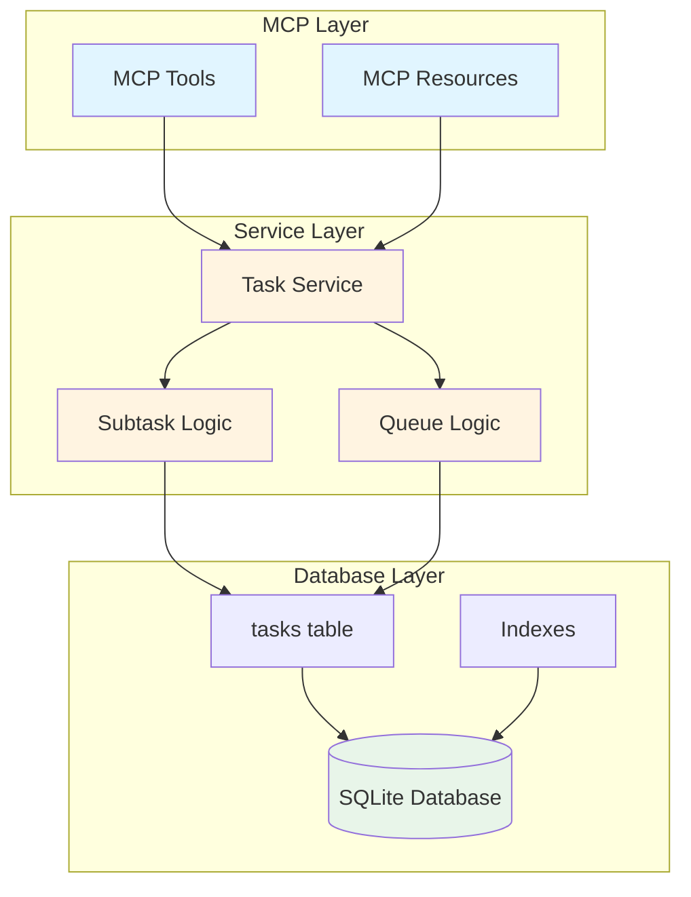

# Subtasks and Queues - Feature Overview

## Executive Summary

This feature adds two major capabilities to TinyTask:

1. **Subtasks**: Hierarchical task relationships enabling task decomposition
2. **Queues**: Team-based task organization (dev, product, qa teams)

## Problem Statement

Currently, TinyTask only supports:
- Flat task lists (no parent-child relationships)
- Individual agent assignment (no team-level organization)

This limits the ability to:
- Break down complex tasks into manageable pieces
- Organize work by functional area or team
- Track unassigned work at the team level
- Plan capacity across teams

## Solution

### Subtasks (Parent-Child Relationships)

**Database Addition**: `parent_task_id` column linking tasks to their parent

**Capabilities**:
- Create task hierarchies (unlimited depth)
- Query subtasks (immediate children or all descendants)
- Automatic cascade delete when parent deleted
- Circular reference prevention
- Optional queue inheritance from parent

**Example**:
```
Task #1: Implement User Authentication (parent)
├─ Task #10: Design database schema (child)
├─ Task #11: Create API endpoints (child)
│  ├─ Task #20: Login endpoint (grandchild)
│  └─ Task #21: Logout endpoint (grandchild)
└─ Task #12: Write tests (child)
```

### Queues (Team Organization)

**Database Addition**: `queue_name` column for team/functional area

**Capabilities**:
- Assign tasks to queues (dev, product, qa, etc.)
- Query all tasks in a queue
- Find unassigned tasks in a queue
- Get queue statistics (total, by status, agents)
- List all active queues
- Filter agent queues by queue name

**Example**:
```
Task ID  Queue    Assigned To  Status
1        dev      Vaela        working
2        dev      unassigned   idle
3        product  Spartus      working
4        product  unassigned   idle
5        qa       Zaeion       idle
6        qa       unassigned   idle
```

## Architecture Overview



## Database Schema Changes

```sql
-- Add new columns to tasks table
ALTER TABLE tasks ADD COLUMN parent_task_id INTEGER REFERENCES tasks(id) ON DELETE CASCADE;
ALTER TABLE tasks ADD COLUMN queue_name TEXT;

-- Create performance indexes
CREATE INDEX idx_tasks_parent_task_id ON tasks(parent_task_id);
CREATE INDEX idx_tasks_queue_name ON tasks(queue_name);
CREATE INDEX idx_tasks_queue_status ON tasks(queue_name, status);
CREATE INDEX idx_tasks_queue_assigned ON tasks(queue_name, assigned_to);
```

## New MCP Tools

### Subtask Tools
- `create_subtask` - Create a subtask under a parent
- `get_subtasks` - Get immediate or recursive subtasks

### Queue Tools
- `get_queue_tasks` - Get all tasks in a queue
- `get_queue_stats` - Get queue statistics
- `get_unassigned_in_queue` - Find unassigned work
- `list_queues` - List all active queues

### Enhanced Tools
- `create_task` - Now accepts `parent_task_id` and `queue_name`
- `update_task` - Can change parent and queue
- `list_tasks` - Filter by queue and parent
- `get_my_queue` - Filter by queue name

## New MCP Resources

- `task://{id}/subtasks` - Subtasks for a task
- `task://{id}/tree` - Task with full hierarchy
- `queue://{queue_name}/tasks` - All tasks in queue
- `queue://{queue_name}/unassigned` - Unassigned tasks in queue
- `queue://{queue_name}/stats` - Queue statistics
- `queues://list` - All active queues

## Use Cases

### Use Case 1: Task Decomposition

**Scenario**: Break down a complex feature into implementable subtasks

```typescript
// Product creates epic
const epic = await create_task({
  title: 'User Authentication System',
  queue_name: 'product',
  assigned_to: 'Spartus',
  priority: 10,
});

// Create dev subtasks
const dbTask = await create_subtask({
  parent_task_id: epic.id,
  title: 'Design database schema',
  queue_name: 'dev',
  assigned_to: 'Vaela',
});

const apiTask = await create_subtask({
  parent_task_id: epic.id,
  title: 'Implement API endpoints',
  queue_name: 'dev',
  assigned_to: 'Gaion',
});

// Create QA subtask
const testTask = await create_subtask({
  parent_task_id: epic.id,
  title: 'Write integration tests',
  queue_name: 'qa',
  assigned_to: 'Zaeion',
});

// View all subtasks
const subtasks = await get_subtasks({
  parent_task_id: epic.id,
});
```

### Use Case 2: Sprint Planning

**Scenario**: Plan work for the upcoming sprint

```typescript
// Get overview of all queues
const queues = await list_queues({ include_stats: true });

// Find where help is needed
const queuesByUnassigned = queues.queues
  .sort((a, b) => b.stats.unassigned - a.stats.unassigned);

console.log('Queues needing assignment:');
queuesByUnassigned.forEach(q => {
  console.log(`${q.queue_name}: ${q.stats.unassigned} unassigned tasks`);
});

// Get unassigned dev work
const unassignedDev = await get_unassigned_in_queue({
  queue_name: 'dev',
  status: 'idle',
});

// Assign to available developer
await update_task({
  id: unassignedDev.tasks[0].id,
  assigned_to: 'AvailableDev',
});
```

### Use Case 3: Capacity Management

**Scenario**: Check team member workload

```typescript
// Check Vaela's total workload
const vaelaAll = await get_my_queue({ agent_name: 'Vaela' });
console.log(`Vaela has ${vaelaAll.count} tasks total`);

// Break down by queue
const vaelaByQueue = {};
vaelaAll.tasks.forEach(task => {
  const queue = task.queue_name || 'unassigned';
  vaelaByQueue[queue] = (vaelaByQueue[queue] || 0) + 1;
});

console.log('Vaela workload:', vaelaByQueue);
// Output: { dev: 5, product: 2 }

// See only dev queue work
const vaelaDev = await get_my_queue({
  agent_name: 'Vaela',
  queue_name: 'dev',
});
```

### Use Case 4: Progress Tracking

**Scenario**: Track progress on a complex feature

```typescript
// Get feature with all subtasks
const feature = await get_task({ id: 42 });
const subtasks = await get_subtasks({
  parent_task_id: 42,
  recursive: true,
});

// Calculate completion
const total = subtasks.length;
const completed = subtasks.filter(t => t.status === 'complete').length;
const percentage = (completed / total * 100).toFixed(1);

console.log(`Feature: ${feature.title}`);
console.log(`Progress: ${completed}/${total} subtasks (${percentage}%)`);
console.log(`Status breakdown:`);
console.log(`  Idle: ${subtasks.filter(t => t.status === 'idle').length}`);
console.log(`  Working: ${subtasks.filter(t => t.status === 'working').length}`);
console.log(`  Complete: ${completed}`);
```

## Benefits

### For Product Managers
- Break down epics into user stories and tasks
- Track progress on multi-part features
- Organize work by functional area
- See unassigned work across teams

### For Developers
- Understand task context through hierarchy
- Focus on their queue's work
- See team workload distribution
- Break down complex tasks independently

### For QA
- Link tests to features via subtasks
- Track testing work separately (qa queue)
- See what needs testing
- Coordinate with dev team

### For Everyone
- Better organization and clarity
- Improved capacity planning
- Clearer work ownership
- Enhanced collaboration

## Implementation Phases

1. **Database & Types** (2-3 hours)
2. **Service Layer - Subtasks** (4-6 hours)
3. **Service Layer - Queues** (4-6 hours)
4. **MCP Tools - Subtasks** (3-4 hours)
5. **MCP Tools - Queues** (3-4 hours)
6. **MCP Resources** (2-3 hours)
7. **Testing & Documentation** (3-4 hours)

**Total**: 21-30 hours

## Backwards Compatibility

✅ **Fully backwards compatible**

- Existing tasks work unchanged (parent_task_id = NULL, queue_name = NULL)
- Existing tools accept new optional parameters
- Existing resources unchanged
- No data migration required (nullable columns)
- No breaking API changes

## Performance

**Optimized with indexes**:
- Query subtasks: <50ms (100 subtasks)
- Recursive query: <100ms (10 levels deep)
- Queue query: <100ms (1000 tasks)
- Queue statistics: <50ms (aggregation)

## Risk Mitigation

| Risk | Mitigation |
|------|------------|
| Circular references | Validation in service layer prevents cycles |
| Deep hierarchies | Tested to 10+ levels, can limit if needed |
| Performance degradation | Comprehensive indexes, tested at scale |
| Breaking changes | Nullable columns, optional parameters |
| Complex queries | Recursive CTEs well-supported in SQLite 3.8.3+ |

## Success Metrics

- ✅ All 73+ unit tests passing
- ✅ All 20+ integration tests passing
- ✅ Code coverage >90%
- ✅ No breaking changes
- ✅ Performance targets met
- ✅ Documentation complete

## Next Steps

1. Review and approve this plan
2. Begin implementation with Story 1 (Database & Types)
3. Progress through stories sequentially
4. Conduct final review and testing

## Documentation

- **Technical Plan**: [`docs/technical/subtasks-and-queues-implementation-plan.md`](../technical/subtasks-and-queues-implementation-plan.md)
- **Product Stories**: [`docs/product-stories/subtasks-and-queues/`](../product-stories/subtasks-and-queues/)
- **Story README**: [`docs/product-stories/subtasks-and-queues/README.md`](../product-stories/subtasks-and-queues/README.md)

## Questions?

Refer to the technical implementation plan for detailed architecture decisions, SQL queries, and implementation specifics.
