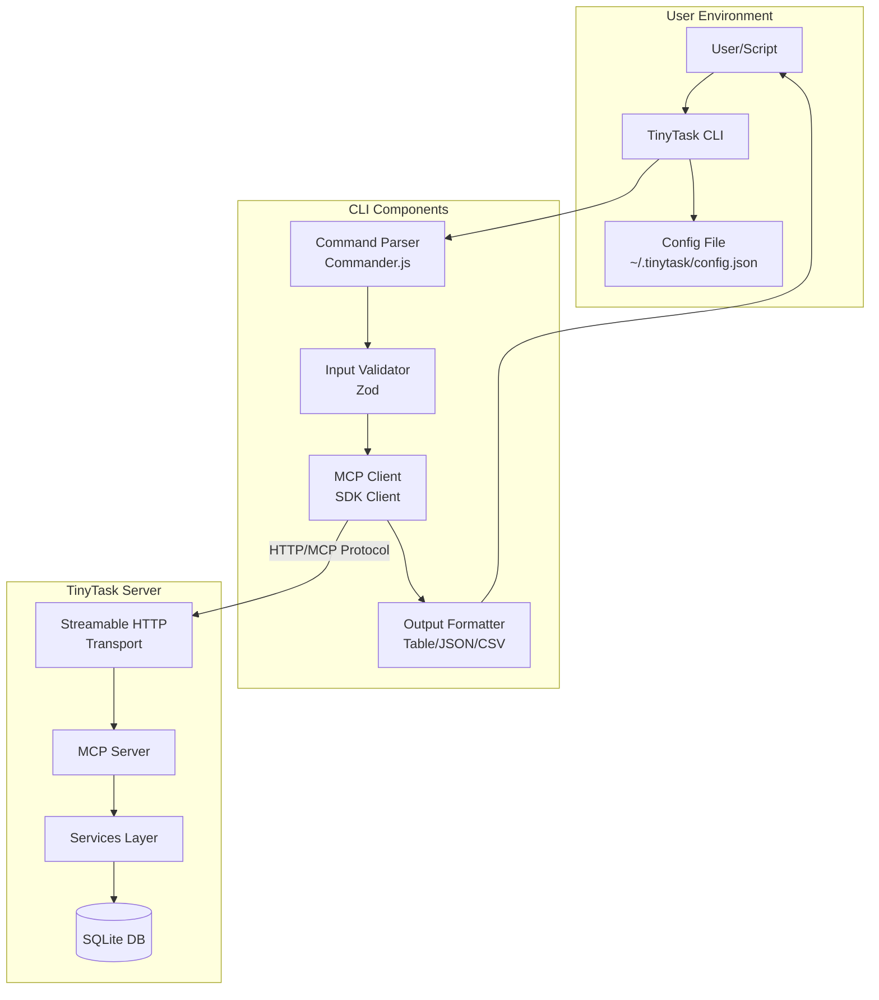
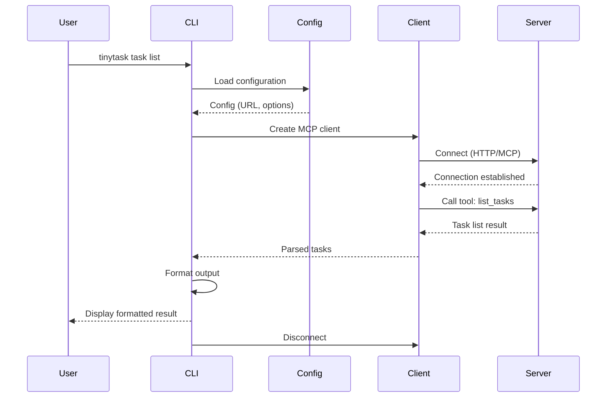
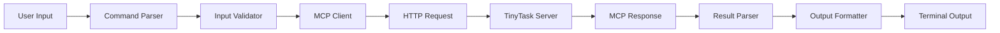

# TinyTask CLI - Technical Architecture

## Overview

The TinyTask CLI is a command-line client that connects to a TinyTask MCP server over Streamable HTTP, providing terminal access to all TinyTask operations (tasks, comments, links, queues).

## Architecture Diagram



## Technology Stack

### Core Dependencies
- **Node.js**: Runtime environment (v18+)
- **TypeScript**: Type-safe development
- **@modelcontextprotocol/sdk**: MCP client implementation
- **Commander.js**: CLI framework and command parsing
- **Zod**: Runtime type validation

### Output Formatting
- **chalk**: Terminal colors and styling
- **cli-table3**: ASCII table rendering
- **cli-spinners**: Progress indicators
- Native JSON/CSV formatting

### Configuration
- **cosmiconfig**: Flexible configuration file loading
- Supports `.tinytaskrc`, `.tinytask.json`, `package.json#tinytask`
- Environment variable overrides

### Build & Distribution
- **tsup**: Fast TypeScript bundler
- **npm**: Primary distribution
- **pkg** (optional): Standalone binary for platforms without Node.js

## Project Structure

```
tinytask-cli/
├── src/
│   ├── index.ts                 # CLI entry point (#!/usr/bin/env node)
│   ├── cli.ts                   # Main CLI setup and command registration
│   ├── client/
│   │   ├── mcp-client.ts        # MCP client wrapper
│   │   ├── connection.ts        # Connection management
│   │   └── types.ts             # Client type definitions
│   ├── commands/
│   │   ├── task/
│   │   │   ├── create.ts        # task create command
│   │   │   ├── get.ts           # task get command
│   │   │   ├── update.ts        # task update command
│   │   │   ├── delete.ts        # task delete command
│   │   │   ├── list.ts          # task list command
│   │   │   └── archive.ts       # task archive command
│   │   ├── comment/
│   │   │   ├── add.ts           # comment add command
│   │   │   ├── list.ts          # comment list command
│   │   │   ├── update.ts        # comment update command
│   │   │   └── delete.ts        # comment delete command
│   │   ├── link/
│   │   │   ├── add.ts           # link add command
│   │   │   ├── list.ts          # link list command
│   │   │   ├── update.ts        # link update command
│   │   │   └── delete.ts        # link delete command
│   │   ├── queue.ts             # queue command
│   │   ├── signup.ts            # signup command
│   │   ├── move.ts              # move command
│   │   ├── config.ts            # config command
│   │   └── bulk.ts              # bulk operations
│   ├── formatters/
│   │   ├── table.ts             # Table output formatter
│   │   ├── json.ts              # JSON output formatter
│   │   ├── csv.ts               # CSV output formatter
│   │   ├── compact.ts           # Compact output formatter
│   │   └── index.ts             # Formatter factory
│   ├── config/
│   │   ├── loader.ts            # Configuration loader
│   │   ├── schema.ts            # Configuration schema (Zod)
│   │   └── defaults.ts          # Default configuration
│   ├── utils/
│   │   ├── errors.ts            # Error handling utilities
│   │   ├── validation.ts        # Input validation helpers
│   │   ├── logger.ts            # Logging utilities
│   │   └── spinner.ts           # Progress spinner helpers
│   └── types/
│       ├── commands.ts          # Command type definitions
│       └── config.ts            # Config type definitions
├── tests/
│   ├── unit/                    # Unit tests
│   ├── integration/             # Integration tests
│   └── fixtures/                # Test fixtures and mocks
├── docs/
│   ├── commands/                # Command documentation
│   └── examples/                # Usage examples
├── package.json
├── tsconfig.json
├── tsup.config.ts              # Build configuration
└── README.md
```

## Component Details

### 1. MCP Client Wrapper

The MCP client wrapper manages the connection to the TinyTask server and provides a clean API for CLI commands.

```typescript
// src/client/mcp-client.ts
import { Client } from '@modelcontextprotocol/sdk/client/index.js';
import { StreamableHTTPClientTransport } from '@modelcontextprotocol/sdk/client/streamable.js';

export class TinyTaskClient {
  private client: Client;
  private transport: StreamableHTTPClientTransport;
  
  constructor(serverUrl: string) {
    this.transport = new StreamableHTTPClientTransport(
      new URL(serverUrl)
    );
    
    this.client = new Client(
      {
        name: 'tinytask-cli',
        version: '1.0.0',
      },
      {
        capabilities: {},
      }
    );
  }
  
  async connect(): Promise<void> {
    await this.client.connect(this.transport);
  }
  
  async disconnect(): Promise<void> {
    await this.client.close();
  }
  
  // Task operations
  async createTask(params: CreateTaskParams): Promise<Task> {
    const result = await this.client.callTool({
      name: 'create_task',
      arguments: params,
    });
    return this.parseResult(result);
  }
  
  async getTask(id: number): Promise<Task> {
    const result = await this.client.callTool({
      name: 'get_task',
      arguments: { id },
    });
    return this.parseResult(result);
  }
  
  async listTasks(filters?: TaskFilters): Promise<Task[]> {
    const result = await this.client.callTool({
      name: 'list_tasks',
      arguments: filters || {},
    });
    return this.parseResult(result);
  }
  
  // ... more operations
  
  private parseResult(result: CallToolResult): any {
    if (result.isError) {
      throw new Error(result.content[0].text);
    }
    return JSON.parse(result.content[0].text);
  }
}
```

### 2. Command Structure

Commands follow a hierarchical structure with Commander.js:

```typescript
// src/cli.ts
import { Command } from 'commander';
import { createTaskCommands } from './commands/task/index.js';
import { createCommentCommands } from './commands/comment/index.js';
import { loadConfig } from './config/loader.js';

export function createCLI(): Command {
  const program = new Command();
  
  program
    .name('tinytask')
    .description('TinyTask CLI - Command-line task management')
    .version('1.0.0');
  
  // Global options
  program
    .option('--url <url>', 'TinyTask server URL')
    .option('--profile <name>', 'Configuration profile to use')
    .option('--json', 'Output as JSON')
    .option('--csv', 'Output as CSV')
    .option('--compact', 'Compact output format')
    .option('--no-color', 'Disable colored output')
    .option('--quiet', 'Suppress non-essential output')
    .option('--verbose', 'Enable verbose logging');
  
  // Task commands
  const taskCmd = program.command('task').alias('t').description('Task operations');
  createTaskCommands(taskCmd);
  
  // Comment commands
  const commentCmd = program.command('comment').alias('c').description('Comment operations');
  createCommentCommands(commentCmd);
  
  // ... more command groups
  
  // Convenience aliases at root level
  program
    .command('create <title>')
    .description('Create a new task (alias for task create)')
    .action(async (title, options) => {
      // Delegate to task create command
    });
  
  return program;
}
```

### 3. Output Formatters

Multiple output formats to support different use cases:

```typescript
// src/formatters/index.ts
import { TableFormatter } from './table.js';
import { JSONFormatter } from './json.js';
import { CSVFormatter } from './csv.js';
import { CompactFormatter } from './compact.js';

export interface Formatter {
  format(data: any): string;
}

export function createFormatter(type: 'table' | 'json' | 'csv' | 'compact', options: FormatterOptions): Formatter {
  switch (type) {
    case 'table':
      return new TableFormatter(options);
    case 'json':
      return new JSONFormatter(options);
    case 'csv':
      return new CSVFormatter(options);
    case 'compact':
      return new CompactFormatter(options);
    default:
      return new TableFormatter(options);
  }
}

// src/formatters/table.ts
import Table from 'cli-table3';
import chalk from 'chalk';

export class TableFormatter implements Formatter {
  constructor(private options: FormatterOptions) {}
  
  format(tasks: Task[]): string {
    const table = new Table({
      head: ['ID', 'Title', 'Status', 'Assigned', 'Priority'].map(h => 
        this.options.color ? chalk.cyan(h) : h
      ),
      style: {
        head: [],
        border: this.options.color ? ['gray'] : []
      }
    });
    
    tasks.forEach(task => {
      table.push([
        task.id,
        this.truncate(task.title, 40),
        this.colorStatus(task.status),
        task.assigned_to || '-',
        task.priority
      ]);
    });
    
    return table.toString();
  }
  
  private colorStatus(status: string): string {
    if (!this.options.color) return status;
    
    switch (status) {
      case 'idle': return chalk.yellow(status);
      case 'working': return chalk.blue(status);
      case 'complete': return chalk.green(status);
      default: return status;
    }
  }
  
  private truncate(str: string, len: number): string {
    return str.length > len ? str.substring(0, len - 3) + '...' : str;
  }
}
```

### 4. Configuration Management

Flexible configuration with multiple sources:

```typescript
// src/config/schema.ts
import { z } from 'zod';

export const ConfigSchema = z.object({
  url: z.string().url().optional(),
  defaultAgent: z.string().optional(),
  outputFormat: z.enum(['table', 'json', 'csv', 'compact']).default('table'),
  colorOutput: z.boolean().default(true),
  profiles: z.record(
    z.object({
      url: z.string().url(),
      defaultAgent: z.string().optional(),
    })
  ).optional(),
});

export type Config = z.infer<typeof ConfigSchema>;

// src/config/loader.ts
import { cosmiconfig } from 'cosmiconfig';
import { ConfigSchema, Config } from './schema.js';

export async function loadConfig(profile?: string): Promise<Config> {
  const explorer = cosmiconfig('tinytask');
  const result = await explorer.search();
  
  let config: Config = {
    outputFormat: 'table',
    colorOutput: true,
  };
  
  if (result?.config) {
    config = { ...config, ...result.config };
  }
  
  // Apply profile if specified
  if (profile && config.profiles?.[profile]) {
    config = { ...config, ...config.profiles[profile] };
  }
  
  // Environment variable overrides
  if (process.env.TINYTASK_URL) {
    config.url = process.env.TINYTASK_URL;
  }
  if (process.env.TINYTASK_AGENT) {
    config.defaultAgent = process.env.TINYTASK_AGENT;
  }
  if (process.env.TINYTASK_FORMAT) {
    config.outputFormat = process.env.TINYTASK_FORMAT as any;
  }
  
  // Validate configuration
  return ConfigSchema.parse(config);
}
```

### 5. Error Handling

Comprehensive error handling with helpful messages:

```typescript
// src/utils/errors.ts
import chalk from 'chalk';

export class CLIError extends Error {
  constructor(
    message: string,
    public exitCode: number = 1,
    public suggestions?: string[]
  ) {
    super(message);
    this.name = 'CLIError';
  }
}

export function handleError(error: Error): never {
  if (error instanceof CLIError) {
    console.error(chalk.red('✗ Error:'), error.message);
    
    if (error.suggestions && error.suggestions.length > 0) {
      console.error(chalk.yellow('\nSuggestions:'));
      error.suggestions.forEach(suggestion => {
        console.error(chalk.yellow('  •'), suggestion);
      });
    }
    
    process.exit(error.exitCode);
  }
  
  // Connection errors
  if (error.message.includes('ECONNREFUSED')) {
    console.error(chalk.red('✗ Connection Error:'), 'Cannot connect to TinyTask server');
    console.error(chalk.yellow('\nSuggestions:'));
    console.error(chalk.yellow('  •'), 'Check if the server is running');
    console.error(chalk.yellow('  •'), 'Verify the server URL in your configuration');
    console.error(chalk.yellow('  •'), 'Try:', chalk.cyan('tinytask config show'));
    process.exit(1);
  }
  
  // Generic error
  console.error(chalk.red('✗ Unexpected Error:'), error.message);
  if (process.env.DEBUG) {
    console.error(error.stack);
  }
  process.exit(1);
}
```

## Connection Flow



## Data Flow



## Performance Considerations

### Response Time Targets
- Simple operations (get, create): < 200ms
- List operations with filters: < 500ms
- Bulk operations: < 2s for 100 items

### Optimization Strategies
1. **Connection Reuse**: Keep connection open for multiple operations in bulk commands
2. **Lazy Loading**: Only load configuration when needed
3. **Streaming Output**: Stream large result sets instead of buffering
4. **Parallel Operations**: Use Promise.all for independent bulk operations
5. **Caching**: Cache server connection validation

### Memory Management
- Stream large datasets instead of loading into memory
- Limit default list operations to reasonable page sizes
- Implement pagination for large result sets

## Security Considerations

### Authentication
- Future: Support for API keys or tokens
- Pass credentials via environment variables (not CLI args)
- Store sensitive config with appropriate file permissions (0600)

### Input Validation
- Validate all user input before sending to server
- Sanitize SQL-like characters in search queries
- Validate URLs before connection attempts

### Error Messages
- Don't expose sensitive server information in errors
- Provide helpful messages without revealing internal structure

## Testing Strategy

### Unit Tests
```typescript
// tests/unit/formatters/table.test.ts
import { TableFormatter } from '../../../src/formatters/table.js';

describe('TableFormatter', () => {
  it('should format tasks as ASCII table', () => {
    const formatter = new TableFormatter({ color: false });
    const tasks = [
      { id: 1, title: 'Task 1', status: 'idle', assigned_to: 'alice', priority: 5 }
    ];
    
    const output = formatter.format(tasks);
    expect(output).toContain('Task 1');
    expect(output).toContain('idle');
  });
});
```

### Integration Tests
```typescript
// tests/integration/task-commands.test.ts
import { createCLI } from '../../src/cli.js';
import { startTestServer } from '../helpers/test-server.js';

describe('Task Commands', () => {
  let server: TestServer;
  
  beforeAll(async () => {
    server = await startTestServer();
  });
  
  afterAll(async () => {
    await server.stop();
  });
  
  it('should create task via CLI', async () => {
    const cli = createCLI();
    await cli.parseAsync(['node', 'tinytask', 'create', 'Test Task', '--json']);
    
    // Verify task was created
    const tasks = await server.getTasks();
    expect(tasks).toHaveLength(1);
    expect(tasks[0].title).toBe('Test Task');
  });
});
```

### E2E Tests
```bash
# tests/e2e/cli.test.sh
#!/bin/bash

# Start test server
docker-compose up -d tinytask-test

# Test CLI commands
tinytask --url http://localhost:3000/mcp create "E2E Test" --json
TASK_ID=$(tinytask list --json | jq -r '.[0].id')
tinytask get $TASK_ID --json
tinytask update $TASK_ID --status working --json
tinytask comment add $TASK_ID "Test comment"
tinytask delete $TASK_ID

# Cleanup
docker-compose down
```

## Build & Distribution

### NPM Package
```json
{
  "name": "tinytask-cli",
  "version": "1.0.0",
  "bin": {
    "tinytask": "./dist/index.js"
  },
  "scripts": {
    "build": "tsup src/index.ts --format esm --dts",
    "dev": "tsup src/index.ts --watch --format esm",
    "test": "vitest run",
    "prepublishOnly": "npm run build && npm test"
  }
}
```

### Standalone Binary (Optional)
```bash
# Build standalone binaries with pkg
npm run build
pkg . --targets node18-linux-x64,node18-macos-x64,node18-win-x64 --output dist/tinytask
```

## Deployment

### Installation
```bash
# Via npm
npm install -g tinytask-cli

# Via yarn
yarn global add tinytask-cli

# Via pnpm
pnpm add -g tinytask-cli

# From source
git clone https://github.com/org/tinytask-cli
cd tinytask-cli
npm install
npm run build
npm link
```

### Configuration
```bash
# Initialize configuration
tinytask config init

# Set server URL
tinytask config set url http://localhost:3000/mcp

# Set default agent
tinytask config set default-agent myname

# Create profile
tinytask config profile add prod --url https://prod.example.com/mcp
```

## Monitoring & Logging

### Logging Levels
- **Error**: Critical failures only
- **Warn**: Important warnings
- **Info**: General information (default)
- **Debug**: Detailed debugging (--verbose)
- **Trace**: Full request/response logging

### Metrics to Track
- Command execution time
- Connection success/failure rate
- Most used commands
- Error frequency by type

## Future Enhancements

### Phase 2
- Shell completions (bash, zsh, fish)
- Interactive mode with prompts
- Task templates
- Workflow definitions

### Phase 3
- TUI dashboard mode
- Real-time task watching
- Git integration
- Plugin system

## References

- [MCP SDK Documentation](https://modelcontextprotocol.io/)
- [Commander.js Documentation](https://github.com/tj/commander.js)
- [TinyTask MCP Server Architecture](./architecture.md)
- [TinyTask API Design](./mcp-api-design.md)
