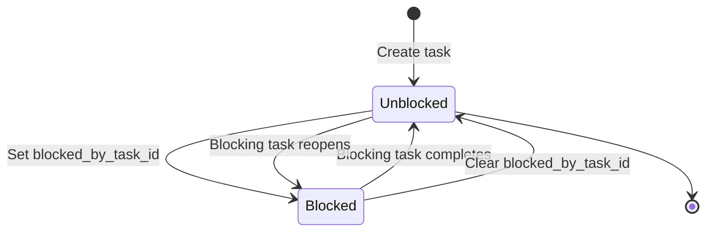
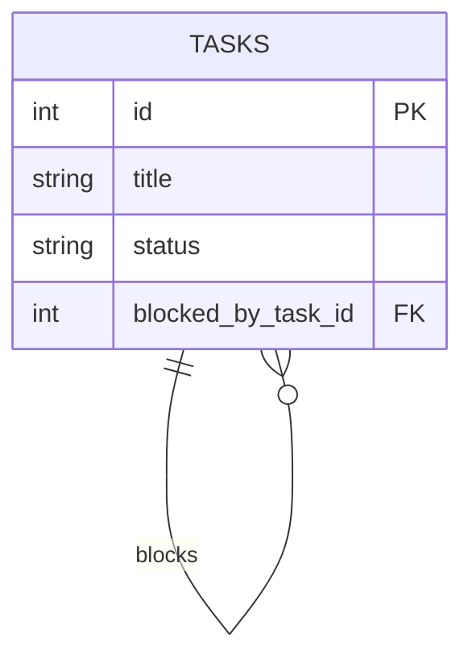
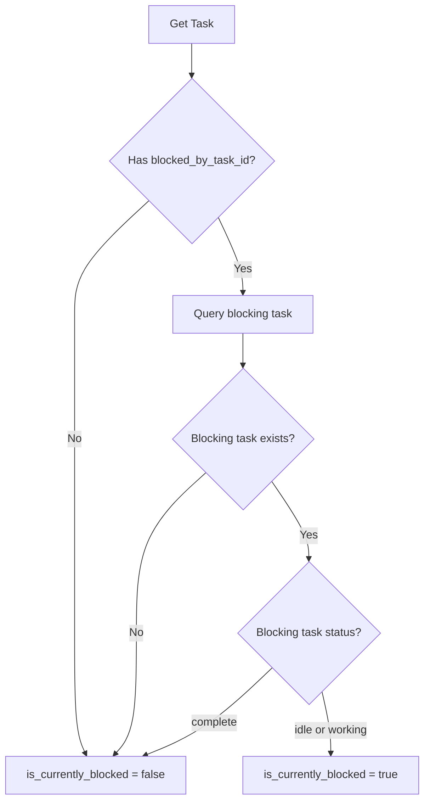

# Task Blocking Feature - Implementation Plan

## Overview

Add task blocking capability to TinyTask MCP, allowing tasks to be blocked by other tasks. When a blocking task is completed, blocked tasks become unblocked. If the blocking task is reopened, previously blocked tasks become blocked again.

## Requirements Summary

1. Tasks can be blocked by other tasks via `blocked_by_task_id` field
2. A task cannot block itself
3. The `blocked_by_task_id` field is persistent (never auto-cleared)
4. Blocking state is computed based on the blocking task's status
5. When blocking task status = 'complete', blocked tasks are effectively unblocked
6. When blocking task reopens (status != 'complete'), blocked tasks become blocked again
7. Users can manually clear `blocked_by_task_id` if they find a workaround

## Architecture: Single Field with Computed State

We'll use a single `blocked_by_task_id` field with computed blocking state at query time. This matches existing patterns in the codebase (like task depth calculation) and keeps the schema simple.

---

## 1. Database Schema Changes

### Schema Update

Add to [`src/db/schema.sql`](../src/db/schema.sql:5):

```sql
-- In tasks table (line ~16, after queue_name)
blocked_by_task_id INTEGER,
FOREIGN KEY (blocked_by_task_id) REFERENCES tasks(id) ON DELETE SET NULL
```

**Foreign Key Behavior:**
- `ON DELETE SET NULL`: If blocking task is deleted, clear the blocked_by_task_id
- This prevents orphaned references while preserving the blocked task

### Index Creation

Add to [`src/db/schema.sql`](../src/db/schema.sql:23):

```sql
-- Performance index for finding blocked tasks
CREATE INDEX IF NOT EXISTS idx_tasks_blocked_by ON tasks(blocked_by_task_id);
```

**Why this index:**
- Enables fast queries for "all tasks blocked by task X"
- Supports cascade unblocking when task status changes
- Minimal overhead (nullable column, sparse index)

### Migration Logic

Add to [`src/db/client.ts`](../src/db/client.ts:42) in `runMigrations()`:

```typescript
// Add blocked_by_task_id column
if (!this.columnExists('tasks', 'blocked_by_task_id')) {
  this.db.exec(`ALTER TABLE tasks ADD COLUMN blocked_by_task_id INTEGER;`);
  this.db.exec(`CREATE INDEX IF NOT EXISTS idx_tasks_blocked_by ON tasks(blocked_by_task_id);`);
}
```

---

## 2. Type System Updates

### Database Type

Update [`src/types/database.ts`](../src/types/database.ts:5):

```typescript
export interface Task {
  id: number;
  title: string;
  description: string | null;
  status: 'idle' | 'working' | 'complete';
  assigned_to: string | null;
  previous_assigned_to: string | null;
  created_by: string | null;
  priority: number;
  tags: string | null; // JSON array
  parent_task_id: number | null;
  queue_name: string | null;
  blocked_by_task_id: number | null;  // NEW
  created_at: string;
  updated_at: string;
  archived_at: string | null;
}
```

### Parsed Task Type

Update [`src/types/index.ts`](../src/types/index.ts:1) ParsedTask interface:

```typescript
export interface ParsedTask {
  id: number;
  title: string;
  description: string | null;
  status: TaskStatus;
  assigned_to: string | null;
  previous_assigned_to: string | null;
  created_by: string | null;
  priority: number;
  tags: string[];
  parent_task_id: number | null;
  queue_name: string | null;
  blocked_by_task_id: number | null;  // NEW
  is_currently_blocked: boolean;      // NEW - computed field
  created_at: string;
  updated_at: string;
  archived_at: string | null;
}
```

### Input Types

Update [`src/types/index.ts`](../src/types/index.ts:1):

```typescript
export interface CreateTaskParams {
  title: string;
  description?: string;
  status?: TaskStatus;
  assigned_to?: string;
  created_by?: string;
  priority?: number;
  tags?: string[];
  parent_task_id?: number | null;
  queue_name?: string | null;
  blocked_by_task_id?: number | null;  // NEW
}

export interface UpdateTaskParams {
  title?: string;
  description?: string;
  status?: TaskStatus;
  assigned_to?: string;
  priority?: number;
  tags?: string[];
  parent_task_id?: number | null;
  queue_name?: string | null;
  blocked_by_task_id?: number | null;  // NEW
}
```

---

## 3. Service Layer Logic

### Core Methods in TaskService

Update [`src/services/task-service.ts`](../src/services/task-service.ts:19):

#### 3.1 Helper Method: Compute Blocking State

```typescript
/**
 * Check if a task is currently blocked
 * A task is blocked if:
 * 1. It has a blocked_by_task_id set
 * 2. The blocking task exists
 * 3. The blocking task status is NOT 'complete'
 */
private isCurrentlyBlocked(task: Task): boolean {
  if (!task.blocked_by_task_id) {
    return false;
  }

  const blockingTask = this.db.queryOne<Task>(
    'SELECT id, status FROM tasks WHERE id = ?',
    [task.blocked_by_task_id]
  );

  if (!blockingTask) {
    // Blocking task doesn't exist (shouldn't happen with FK, but defensive)
    return false;
  }

  // Blocked if blocking task is not complete
  return blockingTask.status !== 'complete';
}
```

#### 3.2 Update parseTask Method

```typescript
/**
 * Parse task from database format to API format
 */
private parseTask(task: Task): ParsedTask {
  return {
    id: task.id,
    title: task.title,
    description: task.description,
    status: task.status,
    assigned_to: task.assigned_to,
    previous_assigned_to: task.previous_assigned_to,
    created_by: task.created_by,
    priority: task.priority,
    tags: task.tags ? JSON.parse(task.tags as string) : [],
    parent_task_id: task.parent_task_id,
    queue_name: task.queue_name,
    blocked_by_task_id: task.blocked_by_task_id,  // NEW
    is_currently_blocked: this.isCurrentlyBlocked(task),  // NEW
    created_at: task.created_at,
    updated_at: task.updated_at,
    archived_at: task.archived_at,
  };
}
```

#### 3.3 Update create Method

Add validation in [`create()`](../src/services/task-service.ts:25):

```typescript
create(params: CreateTaskParams): ParsedTask {
  return this.db.transaction(() => {
    // ... existing validation ...

    // Validate blocked_by_task_id if provided
    if (params.blocked_by_task_id !== undefined && params.blocked_by_task_id !== null) {
      // Cannot block by self (will be validated after insert)
      // For now, just validate the blocking task exists
      const blockingTask = this.get(params.blocked_by_task_id);
      if (!blockingTask) {
        throw new Error(`Blocking task not found: ${params.blocked_by_task_id}`);
      }
    }

    // ... existing code ...

    const result = this.db.execute(
      `INSERT INTO tasks (title, description, status, assigned_to, created_by, priority, tags, parent_task_id, queue_name, blocked_by_task_id)
       VALUES (?, ?, ?, ?, ?, ?, ?, ?, ?, ?)`,
      [
        params.title.trim(),
        params.description || null,
        status,
        params.assigned_to || null,
        params.created_by || null,
        priority,
        tags,
        params.parent_task_id || null,
        queueName,
        params.blocked_by_task_id || null,  // NEW
      ]
    );

    // ... rest of method ...
  });
}
```

#### 3.4 Update update Method

Add validation and update logic in [`update()`](../src/services/task-service.ts:125):

```typescript
update(id: number, updates: UpdateTaskParams): ParsedTask {
  return this.db.transaction(() => {
    // ... existing validation ...

    // Validate blocked_by_task_id if provided
    if (updates.blocked_by_task_id !== undefined) {
      if (updates.blocked_by_task_id !== null) {
        // Prevent task from blocking itself
        if (updates.blocked_by_task_id === id) {
          throw new Error('Task cannot be blocked by itself');
        }

        // Validate blocking task exists
        const blockingTask = this.get(updates.blocked_by_task_id);
        if (!blockingTask) {
          throw new Error(`Blocking task not found: ${updates.blocked_by_task_id}`);
        }

        // Optional: Prevent circular blocking (A blocks B, B blocks A)
        // This is a design decision - do we want to allow chains?
        if (blockingTask.blocked_by_task_id === id) {
          throw new Error('Cannot create circular blocking relationship');
        }
      }
    }

    // ... existing field updates ...

    if (updates.blocked_by_task_id !== undefined) {
      fields.push('blocked_by_task_id = ?');
      values.push(updates.blocked_by_task_id);
    }

    // ... rest of method ...
  });
}
```

#### 3.5 New Helper Method: Get Blocked Tasks

```typescript
/**
 * Get all tasks that are blocked by a specific task
 * Useful for notifications or cascade operations
 */
getBlockedTasks(blockingTaskId: number): ParsedTask[] {
  const tasks = this.db.query<Task>(
    'SELECT * FROM tasks WHERE blocked_by_task_id = ? AND archived_at IS NULL',
    [blockingTaskId]
  );

  return tasks.map(task => this.parseTask(task));
}
```

---

## 4. MCP Tool Updates

### 4.1 Update create_task Tool

Update [`src/tools/task-tools.ts`](../src/tools/task-tools.ts:1):

```typescript
// In tool definition
{
  name: 'create_task',
  description: 'Create a new task in the system',
  inputSchema: {
    type: 'object',
    properties: {
      // ... existing properties ...
      blocked_by_task_id: {
        type: 'number',
        description: 'ID of task that blocks this task. Task will be blocked until the blocking task is completed.',
      },
    },
    required: ['title'],
  },
}
```

### 4.2 Update update_task Tool

```typescript
// In tool definition
{
  name: 'update_task',
  description: 'Update an existing task',
  inputSchema: {
    type: 'object',
    properties: {
      id: {
        type: 'number',
        description: 'Task ID',
      },
      // ... existing properties ...
      blocked_by_task_id: {
        type: 'number',
        description: 'ID of task that blocks this task. Set to null to unblock. Task cannot block itself.',
      },
    },
    required: ['id'],
  },
}
```

### 4.3 New Tool: list_blocked_tasks (Optional)

```typescript
{
  name: 'list_blocked_tasks',
  description: 'Get all tasks that are blocked by a specific task',
  inputSchema: {
    type: 'object',
    properties: {
      blocking_task_id: {
        type: 'number',
        description: 'ID of the blocking task',
      },
    },
    required: ['blocking_task_id'],
  },
}

// Handler
async function listBlockedTasksHandler(
  taskService: TaskService,
  args: { blocking_task_id: number }
): Promise<ToolResponse> {
  const blockedTasks = taskService.getBlockedTasks(args.blocking_task_id);
  
  return {
    content: [
      {
        type: 'text',
        text: JSON.stringify(blockedTasks, null, 2),
      },
    ],
  };
}
```

---

## 5. Validation Rules & Edge Cases

### Validation Rules

1. **Self-blocking Prevention**
   - Task cannot have `blocked_by_task_id = its own id`
   - Validated in `update()` method
   - Error: "Task cannot be blocked by itself"

2. **Blocking Task Existence**
   - `blocked_by_task_id` must reference an existing task
   - Validated in `create()` and `update()` methods
   - Error: "Blocking task not found: {id}"

3. **Circular Blocking Prevention** (Optional - Design Decision)
   - Prevent A blocks B, B blocks A
   - Can be extended to prevent longer chains
   - Error: "Cannot create circular blocking relationship"

4. **Foreign Key Constraint**
   - Database enforces referential integrity
   - `ON DELETE SET NULL` clears blocked_by_task_id if blocking task deleted

### Edge Cases

| Scenario | Behavior | Rationale |
|----------|----------|-----------|
| Blocking task is deleted | `blocked_by_task_id` set to NULL | FK constraint with ON DELETE SET NULL |
| Blocking task is archived | Task remains blocked | Archived tasks can be unarchived |
| Blocked task is archived | Blocking relationship preserved | Can be unarchived and still blocked |
| Blocking task status changes | `is_currently_blocked` recomputed on next query | Automatic, no manual intervention |
| Set `blocked_by_task_id` to NULL | Task becomes unblocked | Manual workaround found |
| Blocking task is a subtask | Allowed | No restriction on task hierarchy |
| Blocked task is a parent | Allowed | Parent can be blocked |
| Chain blocking (A→B→C) | Allowed | Each task tracks only direct blocker |

### Query Performance Considerations

1. **Single Task Query**: O(1) additional query to check blocking task status
2. **List Tasks**: O(n) additional queries if we compute blocking state for all
3. **Optimization**: Could add `LEFT JOIN` to fetch blocking task status in bulk queries

---

## 6. Resource Updates

### Update Task Resources

Update [`src/resources/task-resources.ts`](../src/resources/task-resources.ts:1):

All task resources automatically include the new fields since they use `ParsedTask` type:
- `task://{id}` - includes `blocked_by_task_id` and `is_currently_blocked`
- `task://hierarchy/{id}` - includes blocking info for all tasks in hierarchy
- `tasks://active` - includes blocking info for all active tasks

### New Resource: Blocked Tasks (Optional)

```typescript
{
  uri: 'tasks://blocked-by/{id}',
  name: 'Tasks Blocked By',
  description: 'Get all tasks blocked by a specific task',
  mimeType: 'application/json',
}

// Handler
async function getBlockedByResource(taskId: number): Promise<Resource> {
  const blockedTasks = taskService.getBlockedTasks(taskId);
  
  return {
    uri: `tasks://blocked-by/${taskId}`,
    mimeType: 'application/json',
    text: JSON.stringify(blockedTasks, null, 2),
  };
}
```

---

## 7. Testing Strategy

### Unit Tests

Create [`tests/unit/task-blocking.test.ts`](../tests/unit/task-blocking.test.ts:1):

```typescript
describe('Task Blocking', () => {
  describe('Validation', () => {
    it('should prevent task from blocking itself');
    it('should require blocking task to exist');
    it('should prevent circular blocking (A→B, B→A)');
    it('should allow setting blocked_by_task_id to null');
  });

  describe('Blocking State Computation', () => {
    it('should mark task as blocked when blocking task is idle');
    it('should mark task as blocked when blocking task is working');
    it('should mark task as unblocked when blocking task is complete');
    it('should mark task as blocked again when blocking task reopens');
    it('should mark task as unblocked when blocked_by_task_id is null');
  });

  describe('Foreign Key Behavior', () => {
    it('should set blocked_by_task_id to null when blocking task deleted');
    it('should preserve blocked_by_task_id when blocking task archived');
  });

  describe('Edge Cases', () => {
    it('should allow blocking task to be a subtask');
    it('should allow blocked task to be a parent');
    it('should allow chain blocking (A→B→C)');
    it('should handle blocking task that does not exist gracefully');
  });
});
```

### Integration Tests

Add to [`tests/integration/workflow.test.ts`](../tests/integration/workflow.test.ts:1):

```typescript
describe('Task Blocking Workflow', () => {
  it('should block task until blocker completes');
  it('should unblock task when blocker completes');
  it('should re-block task when blocker reopens');
  it('should allow manual unblocking by clearing blocked_by_task_id');
  it('should list all tasks blocked by a specific task');
});
```

---

## 8. Documentation Updates

### 8.1 Database Schema Documentation

Update [`docs/technical/database-schema.md`](../docs/technical/database-schema.md:1):

```markdown
### blocked_by_task_id

- **Type**: INTEGER (nullable)
- **Foreign Key**: References tasks(id) ON DELETE SET NULL
- **Purpose**: Indicates this task is blocked by another task
- **Behavior**: 
  - Task is "currently blocked" if blocking task status != 'complete'
  - Field is never auto-cleared (preserves relationship)
  - Set to NULL if blocking task is deleted
  - Can be manually cleared if workaround found
- **Index**: idx_tasks_blocked_by for performance
```

### 8.2 Migration Documentation

Update [`docs/technical/database-migrations.md`](../docs/technical/database-migrations.md:1):

```markdown
### Task Blocking (v2.x.x)

Adds support for task blocking relationships:

- **`blocked_by_task_id`**: INTEGER column for blocking relationships
  - Enables task blocking functionality
  - NULL for unblocked tasks
  - Foreign key reference to tasks(id) with ON DELETE SET NULL
  - Index created for query performance
  - Blocking state computed at query time based on blocking task status
```

### 8.3 API Documentation

Create [`docs/technical/task-blocking.md`](../docs/technical/task-blocking.md:1):

```markdown
# Task Blocking Feature

## Overview

Tasks can be blocked by other tasks, preventing work until the blocking task is completed.

## Key Concepts

- **blocked_by_task_id**: The ID of the task that blocks this task
- **is_currently_blocked**: Computed field indicating if task is currently blocked
- **Blocking State**: Task is blocked if blocking task exists AND status != 'complete'

## Usage

### Create Blocked Task

```typescript
const task = await createTask({
  title: 'Implement feature X',
  blocked_by_task_id: 123,  // Blocked by task 123
});
```

### Update Blocking Relationship

```typescript
// Block task
await updateTask(456, { blocked_by_task_id: 123 });

// Unblock task (manual workaround)
await updateTask(456, { blocked_by_task_id: null });
```

### Check Blocking State

```typescript
const task = await getTask(456);
console.log(task.is_currently_blocked);  // true/false
console.log(task.blocked_by_task_id);    // 123 or null
```

## Behavior

1. When blocking task completes: blocked task becomes unblocked
2. When blocking task reopens: blocked task becomes blocked again
3. Blocking relationship is preserved even when blocker is complete
4. Users can manually clear blocking relationship

## Validation

- Task cannot block itself
- Blocking task must exist
- Circular blocking is prevented (A→B, B→A)
```

### 8.4 README Updates

Update [`README.md`](../README.md:1):

Add to features section:
```markdown
- **Task Blocking**: Tasks can be blocked by other tasks, with automatic unblocking when blocker completes
```

---

## 9. Implementation Sequence

### Phase 1: Database & Types (1-2 hours)
1. Update [`schema.sql`](../src/db/schema.sql:5) with new column and index
2. Add migration logic to [`client.ts`](../src/db/client.ts:42)
3. Update type definitions in [`database.ts`](../src/types/database.ts:5) and [`index.ts`](../src/types/index.ts:1)
4. Test migration on fresh and existing databases

### Phase 2: Service Layer (2-3 hours)
1. Add `isCurrentlyBlocked()` helper method
2. Update `parseTask()` to include computed blocking state
3. Add validation to `create()` method
4. Add validation to `update()` method
5. Add `getBlockedTasks()` helper method
6. Write unit tests for service layer

### Phase 3: MCP Tools (1-2 hours)
1. Update `create_task` tool schema and handler
2. Update `update_task` tool schema and handler
3. Optionally add `list_blocked_tasks` tool
4. Update tool documentation

### Phase 4: Resources (1 hour)
1. Verify task resources include new fields
2. Optionally add `tasks://blocked-by/{id}` resource
3. Update resource documentation

### Phase 5: Testing (2-3 hours)
1. Write unit tests for blocking logic
2. Write integration tests for workflows
3. Test edge cases and validation
4. Test migration on existing databases

### Phase 6: Documentation (1-2 hours)
1. Update database schema docs
2. Update migration docs
3. Create task blocking feature doc
4. Update README
5. Update CHANGELOG

**Total Estimated Effort**: 8-13 hours

---

## 10. Rollback Plan

If issues arise:

1. **Schema Rollback**: Column is nullable, can be ignored by old code
2. **Data Safety**: No data loss - column just won't be used
3. **Migration Rollback**: Can drop column if needed (though not recommended)
4. **Feature Toggle**: Could add environment variable to disable blocking checks

---

## 11. Future Enhancements (Out of Scope)

1. **Bulk Operations**: Unblock all tasks blocked by a specific task
2. **Blocking Chains**: Visualize A→B→C blocking chains
3. **Blocking History**: Track when tasks were blocked/unblocked
4. **Notifications**: Alert when blocking task completes
5. **Smart Blocking**: Suggest tasks that might be blocking others
6. **Blocking Reasons**: Add text field for why task is blocked

---

## Mermaid Diagrams

### Blocking State Flow



### Database Relationship



### Blocking State Computation



---

## Summary

This implementation adds task blocking with minimal complexity:

- **Single field**: `blocked_by_task_id` (persistent)
- **Computed state**: `is_currently_blocked` (calculated at query time)
- **Automatic behavior**: Blocking state updates when blocker status changes
- **Manual override**: Users can clear blocking relationship
- **Safe migration**: Nullable column, backward compatible
- **Follows patterns**: Matches existing codebase conventions

The feature integrates cleanly with existing task management, subtasks, and queue functionality without introducing breaking changes.
